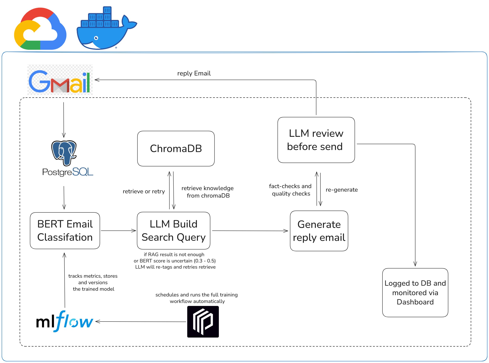

# Agentic Customer Support Gmail Pipeline

> **Case study:** This system is built around a simulated electronic products store called **Fah Mai (ฟ้าใหม่)** - Dataset sourced the Mini Hackathon Super AI Engineer.

This project was built to develop skills in **MLOps and Deployment**. The system uses the Gemini API for language tasks such as drafting replies and reviewing answers. One deliberate addition is **WangChanBERTa** (a Thai-language BERT model) for email classification - it runs locally, costs nothing per request, and improves over time by retraining on staff feedback. This also demonstrates that the pipeline can gradually reduce API dependency: if the remaining LLM calls are replaced with local models such as Qwen or Typhoon, the entire system can run on-premise with no external API at all.

**Live Links:**
Live Links:

**Dashboard**: ~~https://dashboard.ratchapol.site~~  
**MLflow**: ~~https://mlflow.ratchapol.site~~

***Live deployment is currently unavailable because the GCP free credit period has ended. Example screenshots are provided below instead.***

---

<br><br>


<br><br>


<br><br>


<br><br>
---

## Table of Contents

- [How It Works](#how-it-works)
- [Tech Stack](#tech-stack)
- [Quick Start](#quick-start)
- [GPU vs CPU](#gpu-vs-cpu)
- [Common Commands](#common-commands)
- [Environment Variables](#environment-variables)
- [Services](#services)
- [Project Structure](#project-structure)

---

## How It Works



```
Gmail Inbox
    │  (polls every 30s, sorted oldest-first by actual received time)
    ▼
[1] INSPECT - save email to DB; if attachments exist → read with OCR
    │
    ▼
[2] TAG - BERT classifies the email (policy / product / store_info)
    │  if BERT is not confident → LLM classifies instead (fallback)
    ▼
[3] RETRIEVE - fetch relevant documents from the store knowledge base
    │  if results are insufficient or BERT score is borderline → LLM rewrites the query and retries
    ▼
[4] GENERATE - LLM drafts a reply using the retrieved documents
    │
    ▼
[5] REVIEW - a second LLM checks the draft
    │  ✓ good reply → send automatically
    │  ✗ reply needs fixing → write again (up to 3 times)
    │  ✗ not enough information / not related to store / error → Human-in-the-Loop: a person checks instead
    ▼
[6] SEND - send reply via Gmail API

[Dashboard]  → staff review pending emails, correct labels, approve/reject replies
[Monitor]    → counts labeled emails; when ≥ 50 → triggers auto-retrain
[BERT API]   → serves classification requests; reloads new model after retrain with zero downtime
```

### Pipeline Details

### [1] INSPECT - Receive and prepare email

- Polls Gmail API every 60 seconds, filtering out already-processed emails
- Sorts emails oldest-first using Gmail's `internalDate` (actual received time, not fetch time) so replies are sent in the order customers wrote them
- Saves email data to PostgreSQL
- If attachments exist (images or PDFs): downloads them and sends to **Gemini Vision** for OCR so the content is included in the reply context
- Combines email body + OCR output into `full_context` for the next steps

### [2] TAG - Classify the email

- Sends `full_context` to the **BERT API** (fine-tuned WangChanBERTa) to classify whether the email is about:
  - `policy` - store policies such as returns, warranties
  - `product` - products such as specs, pricing, comparisons
  - `store_info` - store information such as branches, opening hours, contact channels
  - A single email can have multiple tags at the same time
- BERT returns a **score per tag** (0.0–1.0)
- **Fallback:** if BERT returns no tags → LLM classifies instead, and the LLM-assigned tags are saved separately in DB (`llm_refined_tags`)
- If neither BERT nor LLM produces a tag → status = `pending`, waiting for staff

### [3] RETRIEVE - Fetch documents from the knowledge base

- Uses tags and a product query from the previous step to search the store knowledge base using **Hybrid RAG**:
  - **BM25** - keyword-based search
  - **BGE-M3** - semantic search on ChromaDB
  - **RRF** (Reciprocal Rank Fusion) - merges both result sets
  - **BGE Reranker** - re-ranks results to select the most relevant documents
- **If results are insufficient or BERT scores are in the uncertain range (0.3–0.5):**
  - LLM checks whether the retrieved documents can actually answer the email
  - If not → LLM rewrites the query and retrieves again

### [4] GENERATE - Draft the reply

- **Gemini LLM** receives `full_context` + retrieved documents + tags and drafts a reply email
- The reply is grounded in the knowledge base only - no hallucination

### [5] REVIEW - Quality check

- A **second LLM** reviews the draft and decides:
  - `send` → reply is good, send it
  - `retry_generate` → reply needs improvement, redraft (up to 3 retries)
  - `retry_rag` → not enough context, retrieve documents again first
  - `human_review` → too complex, or retries exhausted → escalate to staff

### [6] SEND - Send the reply

- Sends the reply via Gmail API from the store's account
- Logs the send result and marks the original email as read

### Auto-Retrain Loop

The system is designed to improve itself over time using staff corrections as training data:

1. **Staff** label or correct email tags in the Dashboard
2. **Monitor** (runs every 10 min) counts how many labeled emails have accumulated
3. When the count hits **50** → **Prefect** triggers a training workflow automatically:
   - Exports labeled data from the database
   - Fine-tunes WangChanBERTa on the new data
   - Registers the new model version in **MLflow** (with metrics logged)
   - **BERT API** hot-reloads the new model without restarting - zero downtime
4. If the new model performs worse than the previous version, it can be **rolled back** to any earlier version via MLflow in one command

---

## Tech Stack

| Component | Technology |
|-----------|-----------|
| Email | Google Gmail API |
| LLM | Gemini 2.5 Flash |
| Classifier | WangChanBERTa (PyTorch, fine-tuned) |
| RAG | ChromaDB + BM25 + BGE-M3 + RRF + BGE Reranker |
| Database | PostgreSQL 15 |
| Dashboard | Streamlit + Plotly |
| MLOps | Prefect + MLflow |
| OCR | Gemini Vision (images + PDFs) |
| API | FastAPI + Uvicorn |
| Deployment | Docker Compose |
| Cloud | Google Cloud Platform (VM, NVIDIA T4 GPU) |

---

## Quick Start

### Prerequisites

- Docker + Docker Compose installed
- Gmail API credentials (`credentials.json`, `token.json`)
- Google Gemini API key

### 1. Clone

```bash
git clone https://github.com/RatchapolSamalee/agentic-customer-support-gmail-pipeline.git
cd agentic-customer-support-gmail-pipeline
```

### 2. Configure environment

```bash
cp .env.example .env
nano .env
```

Required values:
```
GEMINI_API_KEY=your_key_here
POSTGRES_PASSWORD=your_password_here
DB_HOST=postgres
```

### 3. Place Gmail API files

Put these files in the project root:
- `credentials.json` - from Google Cloud Console (OAuth 2.0 Desktop app)
- `token.json` - generated from the first Gmail OAuth login on a machine with a browser

### 4. Start

```bash
docker compose up -d --build
```

On first run the system will automatically:
- Create database tables
- Ingest the knowledge base into ChromaDB
- **Train the initial BERT model** (GPU: ~5–15 min / CPU: ~30–60 min)
- Start all services once BERT is ready

Monitor progress:
```bash
docker compose logs -f bert-api
```

### 5. Access

| Service | URL |
|---------|-----|
| Dashboard | http://YOUR_IP:8501 |
| MLflow UI | http://YOUR_IP:5000 |
| BERT API | http://YOUR_IP:8002 |

Replace `YOUR_IP` with your machine or VM's IP address.

---

## GPU vs CPU

This project has two Docker images:

| | GPU (`Dockerfile`) | CPU (`Dockerfile.cpu`) |
|---|---|---|
| Used by | `bert-api` (training + inference) | pipeline, dashboard, monitor, mlflow |
| Why separate | BERT training is compute-heavy | other services don't need GPU at all |
| Without GPU | system still works, training just takes longer | no impact |

**With an NVIDIA GPU:**

1. Install nvidia-container-toolkit (one-time setup):
```bash
curl -fsSL https://nvidia.github.io/libnvidia-container/gpgkey | sudo gpg --dearmor -o /usr/share/keyrings/nvidia-container-toolkit-keyring.gpg
curl -s -L https://nvidia.github.io/libnvidia-container/stable/deb/nvidia-container-toolkit.list | \
  sed 's#deb https://#deb [signed-by=/usr/share/keyrings/nvidia-container-toolkit-keyring.gpg] https://#g' | \
  sudo tee /etc/apt/sources.list.d/nvidia-container-toolkit.list
sudo apt update && sudo apt install -y nvidia-container-toolkit
sudo nvidia-ctk runtime configure --runtime=docker
sudo systemctl restart docker
```
2. Add to `.env`:
```
DOCKER_RUNTIME=nvidia
```
3. Start normally:
```bash
docker compose up -d --build
```

**Without a GPU (CPU only):**

No extra setup needed. Just start normally:
```bash
docker compose up -d --build
```
BERT training will take longer (~30–60 min instead of ~5–15 min) but everything works the same.

---

## Common Commands

| Action | Command |
|--------|---------|
| Start all services | `docker compose up -d` |
| Stop all services | `docker compose down` |
| Rebuild and restart | `docker compose up -d --build` |
| View pipeline logs | `docker compose logs -f pipeline` |
| View BERT logs | `docker compose logs -f bert-api` |
| Check status | `docker compose ps` |
| Clear database | `docker compose exec postgres psql -U postgres -d autogmail -c "TRUNCATE emails, predictions, generated_replies, feedback_logs, sent_email_logs, retrieved_documents, email_attachments RESTART IDENTITY CASCADE;"` |

---

## Environment Variables

| Variable | Default | Description |
|----------|---------|-------------|
| `GEMINI_API_KEY` | - | **Required.** Google Gemini API key |
| `POSTGRES_PASSWORD` | - | **Required.** PostgreSQL password |
| `DB_HOST` | `localhost` | Set to `postgres` when using Docker |
| `GEMINI_MODEL` | `gemini-2.5-flash` | Default Gemini model |
| `GEMINI_VISION_MODEL` | `gemini-2.5-flash` | Model used for OCR |
| `SCREENING_MODEL` | same as `GEMINI_MODEL` | Override for screening chain |
| `GENERATION_MODEL` | same as `GEMINI_MODEL` | Override for generation chain |
| `REVIEW_MODEL` | same as `GEMINI_MODEL` | Override for review chain |
| `MLFLOW_TRACKING_URI` | `http://localhost:5000` | MLflow server URL |
| `TRAIN_THRESHOLD` | `50` | Number of labeled emails needed to trigger retrain |
| `BERT_MODEL_PATH` | `models/bert-email-tagger` | Local BERT model path |
| `CHROMA_DB_PATH` | `./chroma_db` | ChromaDB path |
| `DOCKER_RUNTIME` | `runc` | Set to `nvidia` to enable GPU |
| `LOG_LEVEL` | `INFO` | Logging level |

---

## Services

| Service | Description |
|---------|-------------|
| `postgres` | Main database |
| `mlflow` | Training tracking + model registry |
| `bert-api` | BERT classification API |
| `pipeline` | Email polling and processing loop (every 60s) |
| `dashboard` | Operator dashboard for staff |
| `monitor` | Counts labeled emails and triggers retrain |

---

## Project Structure

```text
├── dashboard/
│   └── app.py                              Streamlit dashboard
├── docker/
│   ├── entrypoint-bert-api.sh              BERT API startup + initial training
│   ├── entrypoint-pipeline.sh              Pipeline startup + knowledge base ingest
│   └── entrypoint-monitor.sh               Monitor startup
├── mlops/
│   ├── mlflow_server.sh                    Standalone MLflow server script
│   ├── promotion.py                        Model promotion rules/helper
│   └── flows/
│       └── train_bert_flow.py              Alternative/older BERT training flow
├── scripts/
│   ├── ingest_knowledge_base.py            Ingest docs into ChromaDB
│   └── run_pipeline.py                     Script entrypoint for batch/watch pipeline
├── src/
│   ├── __init__.py                         Marks src as a package
│   ├── api.py                              FastAPI BERT API
│   ├── chains.py                           LLM chains (screen, tag, generate, review)
│   ├── classifier.py                       BERT tagger + MLflow integration
│   ├── classifier_client.py                HTTP client for BERT API
│   ├── config.py                           Config from .env
│   ├── gmail_client.py                     Gmail API client
│   ├── models.py                           Pydantic models used across the system
│   ├── ocr.py                              OCR (image + PDF via Gemini Vision)
│   ├── pipeline.py                         Email processing orchestration
│   ├── rag.py                              Hybrid RRF RAG
│   └── db/
│       ├── __init__.py                     DB helper exports
│       ├── base.py                         DB connection and schema
│       ├── emails.py                       Email + attachment DB operations
│       └── pipeline.py                     Prediction/reply/send-log DB operations
├── training/
│   ├── data/
│   │   └── train_set_v1.json               Initial training dataset
│   ├── notebooks/
│   │   └── wangchanberta_finetune_1st_model.ipynb  Early experimentation notebook
│   ├── export_task.py                      Export labeled DB data to JSON
│   ├── monitor_flow.py                     Prefect: threshold check + retrain trigger
│   ├── train_flow.py                       Prefect: fine-tune BERT + register in MLflow
│   └── rollback.py                         Roll back to previous model version
├── store data/
│   └── knowledge_base/
│       ├── policies/                       Policy documents for RAG
│       ├── products/                       Product markdown files for RAG
│       └── store_info/                     General store info / FAQ for RAG
├── .dockerignore                           Docker build ignore rules
├── .env.example                            Example environment variables
├── .gitignore                              Git ignore rules for secrets/generated files
├── Dockerfile                              GPU-enabled image (pytorch/pytorch base)
├── Dockerfile.cpu                          CPU-only image for non-GPU services
├── README.md                               Project overview and quick start
├── Workflow.png                            System workflow diagram
├── docker-compose.yml                      Multi-service local/cloud deployment
└── requirements.txt                        Python dependencies
```

Runtime-only files such as `.env`, `credentials.json`, and `token.json` are not included in the repository for security reasons and must be created and configured locally by the user before running the project.

---

